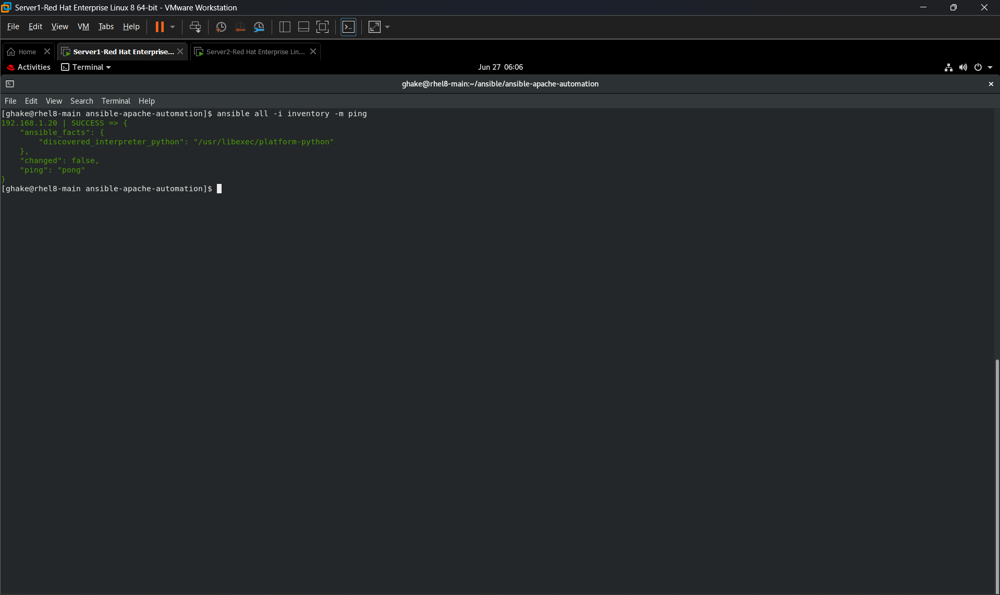
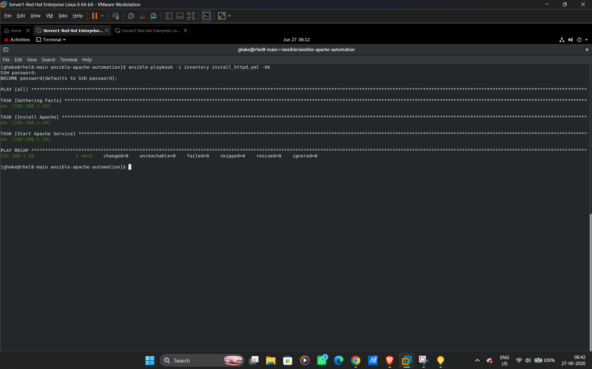
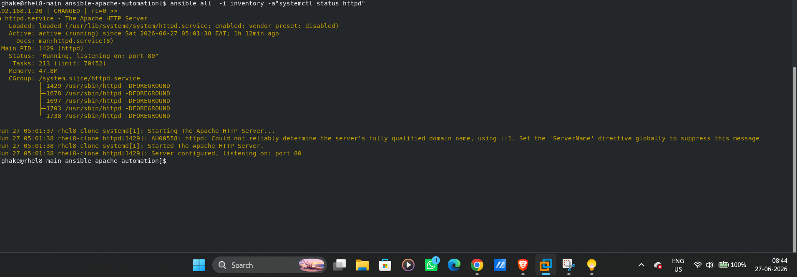
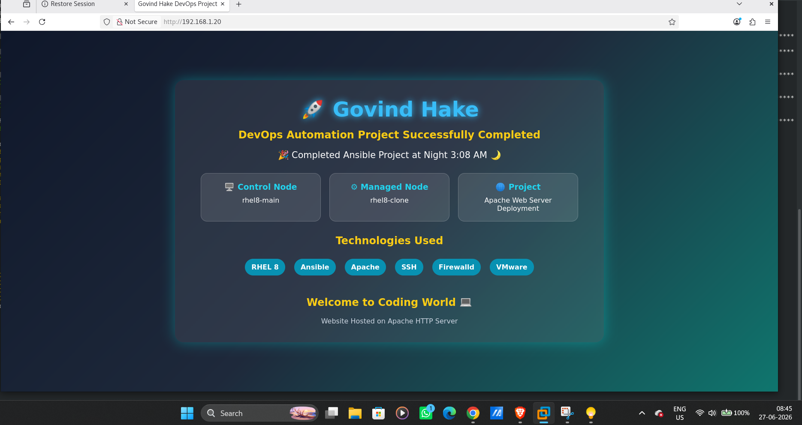
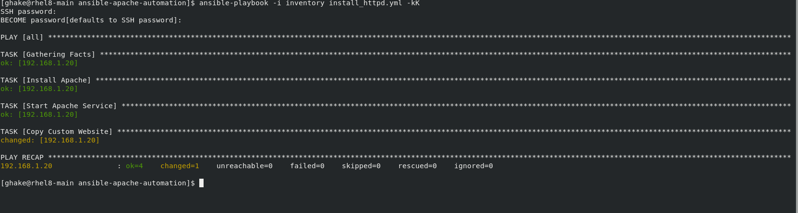
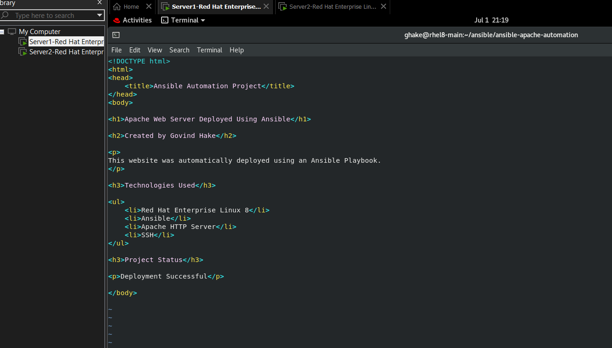
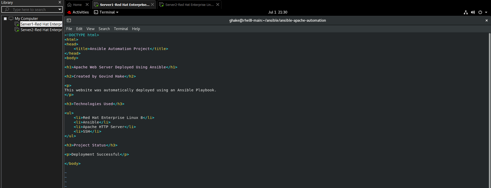
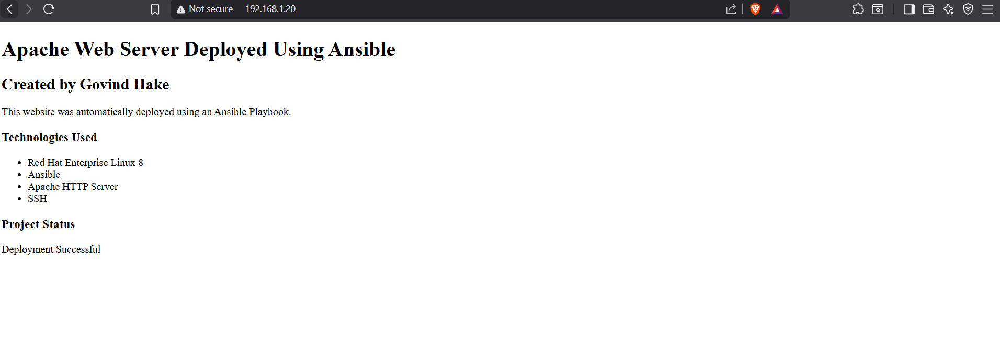

# Automated Apache Web Server Deployment Using Ansible

## Project Overview

This project automates the installation and configuration of Apache HTTP Server on RHEL 8 using Ansible.

## Technologies Used

* Linux (RHEL 8)
* Ansible
* Apache HTTP Server
* SSH
* VMware Workstation

## Project Architecture

Control Node (Ansible Server)
|
| SSH
|
Managed Node (RHEL 8)
|
Apache HTTP Server

## Features

* Automated Apache Installation
* Automated Service Start
* Automated Service Enablement
* Infrastructure Automation

## Inventory File

The inventory file contains the IP address of the managed node.

## Playbook Execution

Run the playbook using:

ansible-playbook -i inventory install_httpd.yml

## Verification

Check Apache status:

systemctl status httpd

Open website:

http://SERVER_IP

## Skills Learned

* Linux Administration
* Ansible Automation
* YAML
* Apache Web Server
* SSH Configuration
* Infrastructure Automation
* DevOps Fundamentals


## Screenshots

### Ansible Connection Test



### Playbook Execution



### Apache Service Status



### Website Output



## Project Demo Video

[Click here to watch demo](https://github.com/govindhake292-dev/ansible-apache-automation/raw/main/ansible-demo.mp4.mp4)

---

# 🚀 Project Enhancement – Custom Website Deployment

This project has been enhanced by adding automatic deployment of a custom HTML website using the Ansible **copy** module. Along with installing and configuring Apache HTTP Server, the playbook now deploys a custom webpage automatically to the managed server.

## New Feature

- Automated deployment of a custom HTML website
- Custom webpage copied automatically to the Apache document root
- Complete web server configuration using Ansible
- Reduced manual deployment effort

---

## Updated Playbook Task

```yaml
- name: Copy Custom Website
  copy:
    src: files/index.html
    dest: /var/www/html/index.html
    owner: root
    group: root
    mode: '0644'
```

---

## Playbook Execution

The playbook was executed successfully.



---

## Custom Website Source Code



---

## HTML File



---

## Website Output

The deployed website is successfully accessible through the Apache Web Server.



---

## Skills Learned After Enhancement

- Apache Web Server Deployment
- Custom Website Deployment
- Ansible Copy Module
- Infrastructure Automation
- Configuration Management
- Linux Administration
- YAML
- SSH
- DevOps Fundamentals
## Author

  Govind Hake
